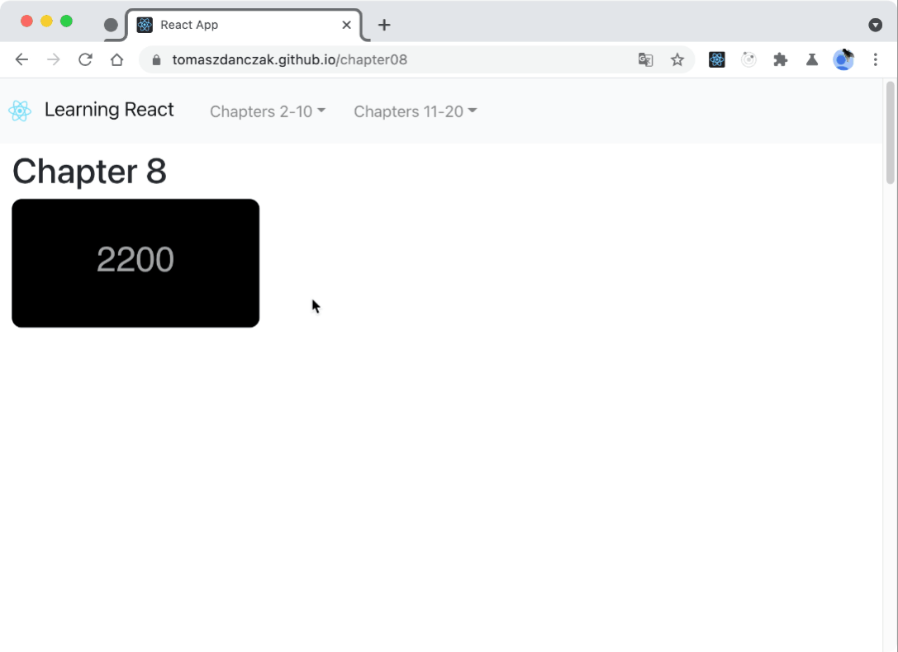
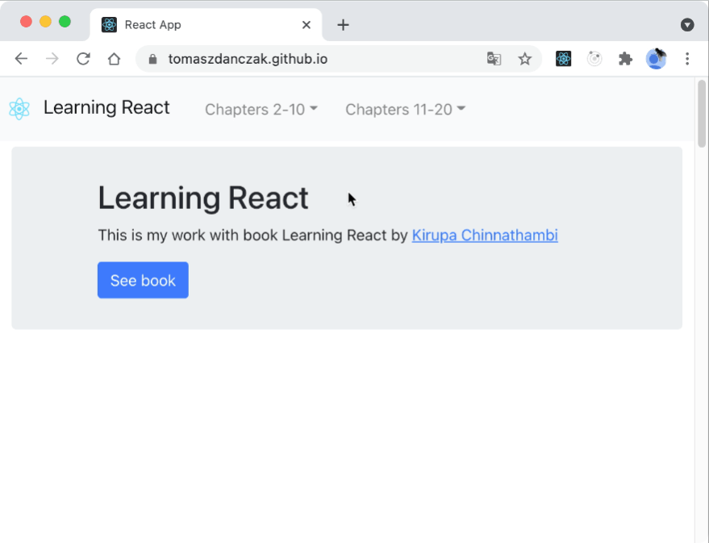
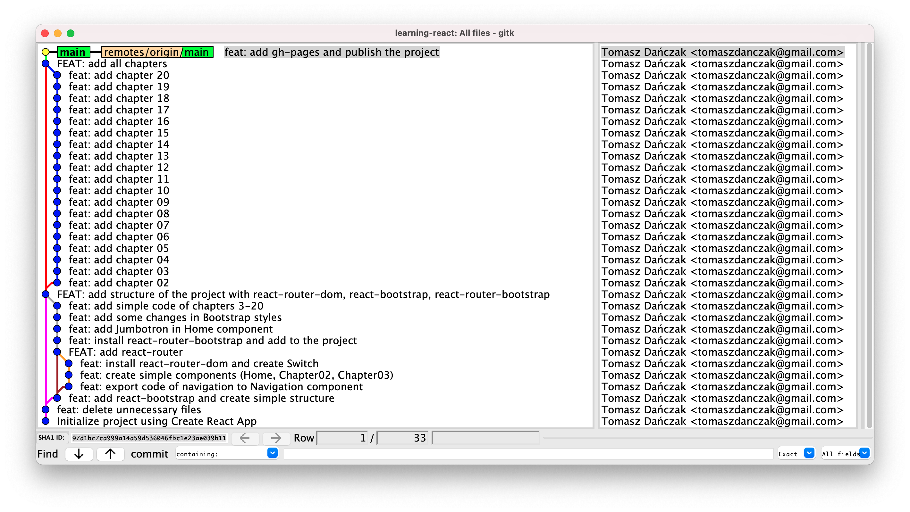

# [Learning React](https://helion.pl/ksiazki/react-i-redux-praktyczne-tworzenie-aplikacji-www-wydanie-ii-kirupa-chinnathambi,rerew2.htm#format/d) by [Kirupa Chinnathambi](https://www.kirupa.com/)
   
## About

This is my work with book [Learning React](https://helion.pl/ksiazki/react-i-redux-praktyczne-tworzenie-aplikacji-www-wydanie-ii-kirupa-chinnathambi,rerew2.htm#format/d) by [Kirupa Chinnathambi](https://www.kirupa.com/).   

See [Live 🚀](https://tomaszdanczak.github.io/learning-react/)  

There is [Kirupa's YouTube Channel](https://www.youtube.com/watch?v=O7zy7gVQRIM&list=PL478wQWRhpfaQbaET2DvDzG60EFGThtd1) where he explained some of chapters from the book.  

There is Kirupa's Github [repository](https://github.com/kirupa/learning-react-book) with code from the book.  

## Things I did myself
### 1. I built the website to show all mini projects

The book doesn't include Bootstrap.  

  

#### 1.1 I used React Router
I used the following tutorial [React Router Tutorial | React For Beginners](https://www.youtube.com/watch?v=Law7wfdg_ls)
#### 1.2 I used React Bootstrap to create Navbar
I used the following tutorial [Make your life easy with React Bootstrap Navbar!](https://www.youtube.com/watch?v=-HEjsVkfjOk)
#### 1.3 I used React Router Bootstrap
There is documentation of [React router bootstrap](https://github.com/react-bootstrap/react-router-bootstrap)
#### 1.4 I used Jumbotron and overwrote some bootstrap styles
### 2. I rebuilt chapters using Create React App
Some of the chapters use CDN. I rebuilt them. Also I did some improvements.  
- I used createPortals only when element is rendered.
- I used clearInterval to delete interval.
- I rebuilt styles.
### 3. I used mouse events to simulate hover effect
I learnt it from this [article](https://www.pluralsight.com/guides/create-a-hover-button-in-a-react-app).
#### 2.1 I created state
```js
state = {
  color: "",
  bgColor: "white",
  buttonStyles: { backgroundColor: "#666", color: "#fff" },
};
```
#### 3.2 I used state in styles
```js
  const buttonStyle = {
  padding: 10,
  fontSize: 16,
  margin: 10,
  backgroundColor: this.state.buttonStyles.backgroundColor,
  color: "#fff",
  border: `2px solid ${this.state.buttonStyles.borderColor}`,
  cursor: "pointer",
}
```

#### 3.3 I used onMouseEnter and onMouseLeave to simulate hover effect in component
```js
<button
  onMouseEnter={() =>
    this.setState({
      buttonStyles: { backgroundColor: "#111", borderColor: "#111" },
    })
  }
  onMouseLeave={() =>
    this.setState({
      buttonStyles: { backgroundColor: "#666", borderColor: "#666" },
    })
  }
  style={buttonStyle}
  type="submit"
>
  OK
</button>
```


```js
```

### 4.  I built clear Git history
   

